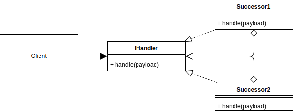
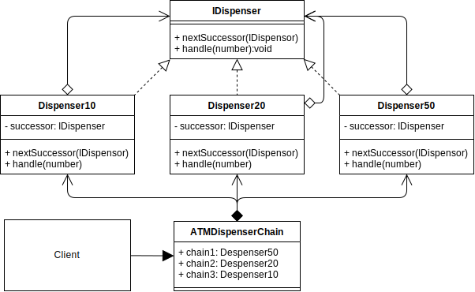

# Chain of Responsibility Design Pattern

## Overview

**Chain of Responsibility** pattern is a behavioral pattern used to achieve loose coupling in software design.

In this pattern, an object is passed to a Successor, and depending on some kind of logic, will or won't be passed onto another successor and processed. There can be any number of different successors and successors can be re-processed recursively.

This process of passing objects through multiple successors is called a chain.

The object that is passed between each successor does not know about which successor will handle it. It is an independent object that may or may not be processed by a particular successor before being passed onto the next.

The chain that the object will pass through is normally dynamic at runtime, although you can hard code the order or start of the chain, so each successor will need to comply with a common interface that allows the object to be received and passed onto the next successor.

## Terminology

- **Handler Interface:** A common interface for handling and passing objects through each successor.
- **Concrete Handler:** The class acting as the Successor handling the requests and passing onto the next.
- **Client:** The application or class that initiates the call to the first concrete handler (successor) in the chain.

## Chain of Responsibility UML Diagram

## Chain of Responsibility Use Case

In the ATM example below, the chain is hard coded in the client first to dispense amounts of £50s, then £20s and then £10s in order.

This default chain order helps to ensure that the minimum number of notes will be dispensed. Otherwise, it might dispense 5 x £10 when it would have been better to dispense 1 x £50.

### CoR Example UML Diagram

## Summary

In the Chain of Responsibility,

- The object/payload will propagate through the chain until fully processed.
- The object does not know which successor or how many will process it.
- The next successor in the chain can either be chosen dynamically at runtime depending on logic from within the current successor, or hard coded if it is more beneficial.
- Successors implement a common interface that makes them work independently of each other, so that they can be used recursively or possibly in a different order.
- A user wizard, or dynamic questionnaire are other common use cases for the chain of responsibility pattern.
  Consider the Chain of Responsibility pattern like the `Composite` pattern (structural) but with logic applied (behavioral).
