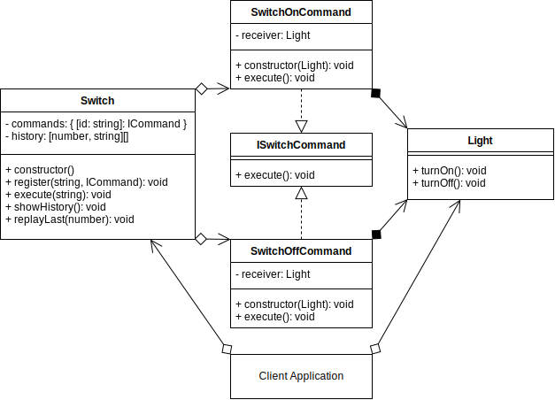

# Command Design Pattern

## Overview

The **Command** pattern is a behavioral design pattern, in which an abstraction exists between an object that invokes a command, and the object that performs it.

E.g., a button will call the **Invoker**, that will call a pre-registered **Command**, that the **Receiver** will perform.

A Concrete Class will delegate a request to a command object, instead of implementing the request directly.

The command pattern is a good solution for implementing UNDO/REDO functionality into your application.

Uses:

- GUI Buttons, menus
- Macro recording
- Multi-level undo/redo
- Networking - send whole command objects across a network, even as a batch
- Parallel processing or thread pools
- Transactional behavior
- Wizards

## Terminology

- **Receiver:** The object that will receive and execute the command.
- **Invoker:** The object that sends the command to the receiver. E.g., A button.
- **Command Object:** Itself, an object, that implements an `execute()`, or other action method, and contains all required information to execute it.
- **Client:** The application or component that is aware of the Receiver, Invoker and Commands.

## Command UML Diagram

## Command Use Case

This will be a smart light switch.

This light switch will keep a history of each time one of its commands was called.

And it can replay its commands.

A smart light switch could be extended in the future to be called remotely or automated depending on sensors.

### Command Example UML Diagram

## Summary

- State should not be managed in the Command object itself.
- There can be one or more Invokers that can execute the Command at a later time.
- The Command object is especially useful if you want to UNDO/REDO commands at later time.
- The Command pattern is similar to the `Memento` pattern in the way that it can also be used for UNDO/REDO purposes. However, the Memento pattern is about recording and replacing the state of an object, whereas the Command pattern executes a predefined command. E.g., Draw, Turn, Resize, Save, etc.
