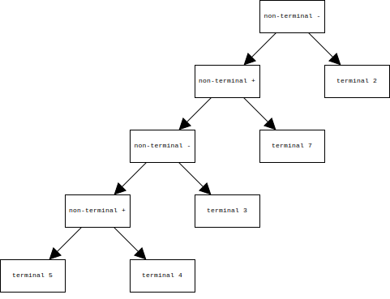
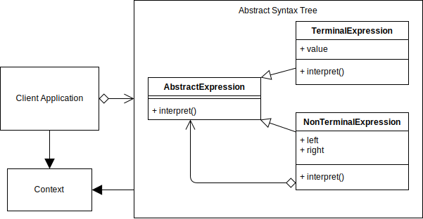
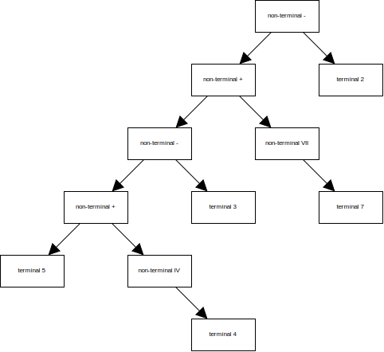
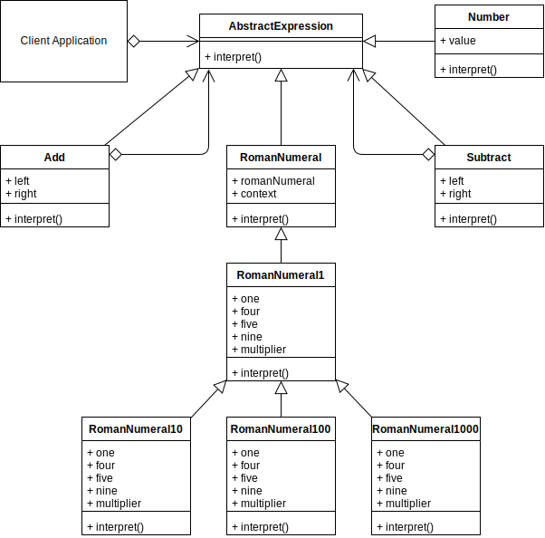

# Interpreter Design Pattern

## Overview

The **Interpreter** pattern helps to convert information from one language into another.

The language can be anything such as words in a sentence, numerical formulas or even software code.

The process is to convert the source information, into an **Abstract Syntax Tree (AST)** of **Terminal** and **Non-Terminal** expressions that all implement an `interpret()` method.

A Non-Terminal expression is a combination of other Non-Terminal and/or Terminal expressions.

Terminal means terminated, i.e., there is no further processing involved.

An AST root starts with a Non-Terminal expression and then resolves down each branch until all expressions terminate.

An example expression is `A + B`.

The `A` and `B` are Terminal expressions and the `+` is Non-Terminal because it depends on the two other Terminal expressions.

The Image below, is an AST for the expression `5 + 4 - 3 + 7 - 2`

The official Interpreter pattern described in the original GoF Design Patterns book does not state how to construct an Abstract Syntax Tree. How your tree is constructed will depend on the grammatical constructs of your sentence that you want to interpret.

Abstract Syntax Trees can be created manually or dynamically from a custom parser script. In the first example code below, I construct the AST manually.

Once the AST is created, you can then choose the root node and then run the Interpret operation on that, and it should interpret the whole tree recursively.

## Terminology

- **Abstract Expression:** Describe the method(s) that Terminal and Non-Terminal expressions should implement.
- **Non-Terminal Expression:** A composite of Terminal and/or Non-Terminal expressions.
- **Terminal Expression:** A leaf node Expression.
- **Context:** Context is state that can be passed through interpret operations if necessary.
- **Client:** Builds or is given an Abstract Syntax Tree to interpret.

## Interpreter UML Diagram

## Interpreter Use Case

The example use case will expand on the concept example by dynamically creating the AST and converting Roman numerals to integers as well as calculating the final result.

The Image below, is an AST for the expression `5 + IV - 3 + VII - 2`

### Interpreter Example UML Diagram

## Summary

- ASTs are hard to create and are an enormous subject in themselves. My recommended approach is to create them manually first using a sample sentence to help understand all the steps individually, and then progress the conversion to be fully dynamic one step at a time ensuring that the grammatical constructs still work as you continue to progress.

- The Interpreter pattern uses a class to represent each grammatical rule.

- ASTs consist of multiple Non-Terminal and Terminal Expressions, that all implement an `interpret()` method.

Note that in the sample code above, the `interpret()` methods in the Non-Terminal expressions, all call further `interpret()` recursively. Only the Terminal expressions `interpret()` method returns an explicit value. See the _Number_ class in the above code.
