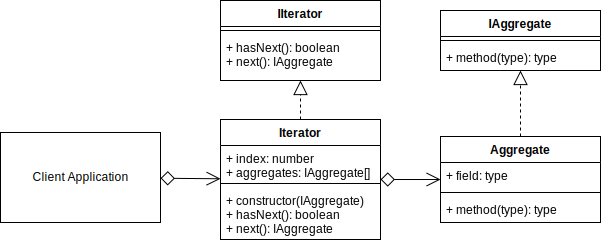
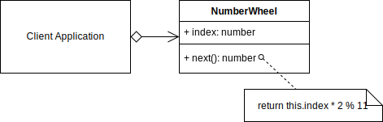

# Iterator Design Pattern

## Overview

The Iterator will commonly contain two methods that perform the following concepts.

- **next:** returns the next object in the aggregate (collection, object).
- **hasNext:** returns a Boolean indicating if the Iterable is at the end of the iteration or not.

The benefits of using the Iterator pattern are that the client can traverse a collection of aggregates(objects) without needing to understand their internal representations and/or data structures.

## Terminology

- **Iterator Interface:** The Interface for an object to implement.
- **Concrete Iterator:** (Iterable) The instantiated object that implements the iterator and contains a collection of aggregates.
- **Aggregate Interface:** An interface for defining an aggregate (object).
- **Concrete Aggregate:** The object that implements the Aggregate interface.

## Iterator UML Diagram

## Iterator Use Case

The iterator in this brief example will return the next number in the iterator multiplied by 2 modulus 11. It dynamically creates the returned object (number) at runtime.

It has no `hasNext()` method since the result is modulated by 11, that will loop the results no matter how large the iterator index is. Furthermore, it will also appear to alternate between a series of even numbers and odd numbers.

Also, just to demonstrate that implementing abstract classes and interfaces is not always necessary, this example uses no abstract base classes or interfaces.

### Iterator Example UML Diagram

## Summary

- Use an iterator when you need to traverse over a collection, or you want an object that can output a series of dynamically created objects.
- At minimum, an iterator needs a `next` equivalent method that returns an object.
- Optionally you can also create a helper function that indicates whether an iterator is at the end or not. This is useful if you use your iterator in a `while` loop.
