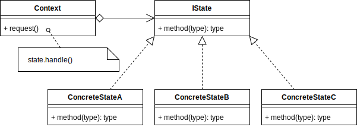
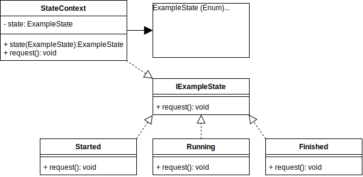

# State Design Pattern

## Overview

Not to be confused with object state, i.e., one of more attributes that can be copied as a snapshot, the State Pattern is more concerned about changing the handle of an object's method dynamically. This makes an object itself more dynamic and may reduce the need of many conditional statements.

Instead of storing a value in an attribute, and then using conditional statements within an objects' method to produce different output, a subclass is assigned as a handle instead. The object/context doesn't need to know about the inner working of the assigned subclass that the task was delegated to.

In the state pattern, the behavior of an objects state is encapsulated within the subclasses that are dynamically assigned to handle it.

## Terminology

- **State Interface:** An interface for encapsulating the behavior associated with a particular state of the Context.
- **Concrete Subclasses:** Each subclass implements a behavior associated with the particular state.
- **Context:** This is the object where the state is defined, but the execution of the state behavior is redirected to the concrete subclass.

## State UML Diagram

## State Use Case

This example takes the concept example further and instead assigns then next state in sequence rather than choosing the states subclasses randomly.

It also allows to set the state outside the context by using a getter/setter.

The client will set the state, and then run a request, and then change the state again, etc., and depending on the state, the behavior of the method would have changed.

### State Example UML Diagram

## Summary

- Makes an object change its behavior when its internal state changes.
  The client and the context are not concerned about the details of how the state is created/assembled/calculated.

- The client will call a method of the context, and it will be handled by a subclass.

- The State pattern appears very similar to the `Strategy` pattern, except in the State pattern, the object/context has changed to a different state and will run a different subclass depending on that state.
