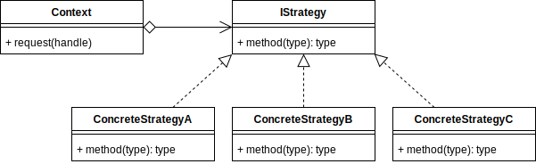
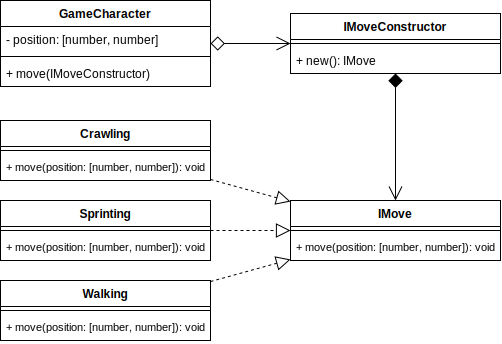

# Strategy Design Pattern

## Overview

The **Strategy** Pattern is similar to the State Pattern, except that the client passes in the algorithm that the context should run.

The algorithm should be contained within a class that implements the particular strategies interface.

An application that sorts data is a good example of where you can incorporate the Strategy pattern.

There are many methods of sorting a set of data. E.g., Quicksort, Mergesort, Introsort, Heapsort, Bubblesort. See [Sorting algorithm](https://en.wikipedia.org/wiki/Sorting_algorithm) for more examples.

The user interface of the client application can provide a drop-down menu to allow the user to try the different sorting algorithms.

Upon user selection, a reference to the algorithm will be passed to the context and processed using this new algorithm instead.

The Strategy and State appear very similar, a good way to differentiate them is to consider whether the state of the context is choosing the algorithm at runtime, or whether the algorithm is being passed into it.

Software Plugins can be implemented using the Strategy pattern.

## Terminology

- **Strategy Interface:** An interface that all Strategy subclasses/algorithms must implement.
- **Concrete Strategy:** The subclass that implements an alternative algorithm.
- **Context:** This is the object that receives the concrete strategy in order to execute it.

## Strategy UML Diagram

## Strategy Use Case

A game character is moving through an environment. Depending on the situation within the current environment, the user decides to use a different movement algorithm. From the perspective of the object/context, it is still a move, but the implementation is encapsulated in the subclass at the handle.

In a real game, the types of things that a particular move could affect is which animation is looped, the audio, the speed, the camera follow mode and more.

### Strategy Example UML Diagram

## Summary

- While the Strategy pattern looks very similar to the State pattern, the assigned strategy subclass/algorithm is not changing any state of the context that would affect which algorithm is used.

- The Strategy pattern is about having a choice of implementations that accomplish the same relative task.

- The particular strategies' algorithm is encapsulated in order to keep the implementation de coupled from the context.

- Software Plugins can be implemented using the Strategy pattern.
