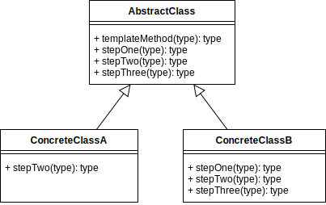
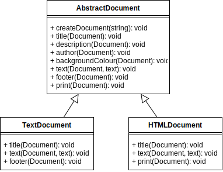

# Template Method Design Pattern

## Overview

In the **Template Method** pattern, you create an abstract class (template) that contains a **Template Method** that is a series of instructions that are a combination of abstract and hook methods.

Abstract methods need to be overridden in the subclasses that extend the abstract (template) class.

Hook methods normally have empty bodies in the abstract class. Subclasses can optionally override the hook methods to create custom implementations.

So, what you have, is an abstract class, with several types of methods, being the main template method, and a combination of abstract and/or hooks, that can be extended by different subclasses that all have the option of customizing the behavior of the template class without changing its underlying algorithm structure.

Template methods are useful to help you factor out common behavior within your library classes.

Note that this pattern describes the behavior of a **method** and how its inner method calls behave.

Hooks are default behavior and can be overridden. They are normally empty by default.

Abstract methods, must be overridden in the concrete class that extends the template class.

## Terminology

- **Abstract Class:** Defines the template method and the primitive steps as abstract and/or hook methods.
- **Concrete Class:** A subclass that extends some or all of the abstract class primitive methods.

## Template Method UML Diagram

## Template Method Use Case

In the example use case, there is an `AbstractDocument` with several methods, some are optional and others must be overridden.

The document will be written out in two different formats.

Depending on the concrete class used, the `text()` method will wrap new lines with `
` tags and the `print()` method will format text with tabs, or include HTML tags.

### Template Method Example UML Diagram

## Summary

- The Template method defines an algorithm in terms of abstract operations and subclasses override some or all of the methods to create concrete behaviors.

- Abstract methods must be overridden in the subclasses that extend the abstract class.

- Hook Methods usually have empty bodies in the super class but can be optionally overridden in the subclass.

- If a class contains many conditional statements, consider converting it to use the Template Method pattern.
