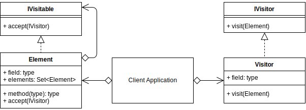
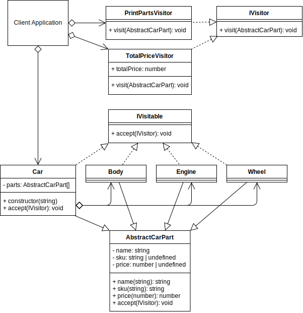

# Visitor Method Design Pattern

## Overview

Your object structure inside an application may be complicated and varied. A good example is what could be created using the **Composite** structure.

The objects that make up the hierarchy of objects, can be anything and most likely complicated to modify as your application grows.

Instead, when designing the objects in your application that may be structured in a hierarchical fashion, you can allow them to implement a Visitor interface.

The Visitor interface describes an `accept()` method that a different object, called a Visitor, will use in order to traverse through the existing object hierarchy and read the internal attributes of an object.

The Visitor pattern is useful when you want to analyze, or reproduce an alternative object hierarchy without implementing extra code in the object classes, except for the original requirements set by implementing the Visitor interface.

Similar to the template pattern it could be used to output different versions of a document but more suited to objects that may be members of a hierarchy.

## Terminology

- **Visitor Interface:** An interface for the Concrete Visitors.
- **Concrete Visitor:** The Concrete Visitor will traverse the hierarchy of elements.
- **Concrete Element:** (Part) An object that will be visited. An application will contain a variable number of Elements/Parts that can be structured in any particular hierarchy.
- **Visitable Interface:** The interface that elements/parts should implement, that describes the accept() method that will allow them to be visited (traversed).

## Visitor UML Diagram

## Visitor Use Case

In the example, the client creates a car with parts.

The car and parts inherit an abstract car parts class with predefined property getters and setters.

Instead of creating methods in the car parts classes and abstract class that run bespoke methods, the car parts can all implement the `IVisitor` interface.

This allows for the later creation of Visitor objects to run specific tasks on the existing hierarchy of objects.

### Visitor Example UML Diagram

## Summary

- Use the Visitor pattern to define an operation to be performed on the elements/parts of a hierarchical object structure.

- Use the Visitor pattern to define the new operation without needing to change the classes of the elements/parts on that it operates.

- When designing your application, you can provision for the future possibility of needing to run custom operations on objects, by implementing the Visitor interface in anticipation.

- Usage of the Visitor pattern helps to ensure that your classes conform to the single responsibility principle due to them implementing the custom visitor behavior in a separate class.
