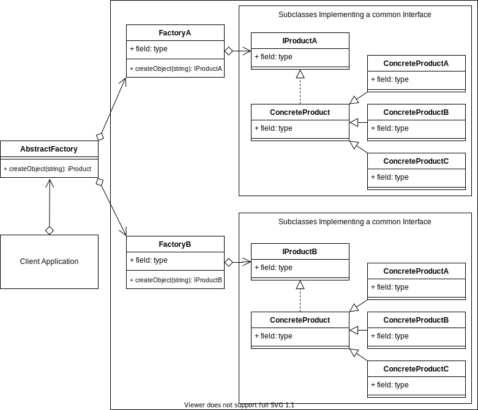

# Abstract Factory Design Pattern

## Overview

The Abstract Factory Pattern adds an abstraction layer over multiple other creational pattern implementations.

To begin with, in simple terms, think if it as a Factory that can return Factories. Although you will find examples of it also being used to return Builder, Prototypes, Singletons or other design pattern implementations.

## Terminology

- **Concrete Creator:** The client application that calls the _Abstract Factory_. It's the same process as the _Concrete Creator_ in the _Factory_ design pattern.

- **Abstract Factory:** A common interface over all the sub factories.

- **Concrete Factory:** The sub factory of the Abstract Factory and contains method(s) to allow creating the _Concrete Product_.

- **Abstract Product:** The interface and/or abstraction for the product that the sub factory returns.

- **Concrete Product:** The object that is finally returned.

## Abstract Factory UML Diagram

## Abstract Factory Example Use Case

An example use case may be that you have a furniture shopfront. You sell many kinds of furniture. You sell chairs and tables. And they are manufactured at different factories using different unrelated processes that are not important for your concern. You only need the factory to deliver.

You can create an extra module called FurnitureFactory, to handle the chair and table factories, thus removing the implementation details from the client.

### Abstract Factory Example UML Diagram

See this UML diagram of an Abstract Furniture Factory implementation that returns chairs and tables.

## Summary

- Use when you want to provide a library of relatively similar products from multiple different factories.
- You want the system to be independent of how the products are created.
- It fulfills all the same use cases as the Factory method, but is a factory for creational pattern type methods.
- The client implements the abstract factory interface, rather than all the internal logic and Factories. This allows the possibility of creating a library that can be imported for using the Abstract Factory.
- The Abstract Factory defers the creation of the final products/objects to its concrete factory subclasses.
- You want to enforce consistent interfaces across products.
- You want the possibility to exchange product families.
