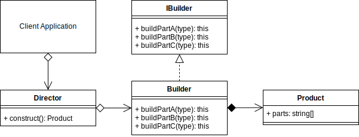

# Builder Design Pattern

## Overview

The Builder Pattern is a creational pattern whose intent is to separate the construction of a complex object from its representation so that you can use the same construction process to create different representations.

The Builder Pattern tries to solve,

- How can a class create different representations of a complex object?
- How can a class that includes creating a complex object be simplified?

The Builder and Factory patterns are very similar in the fact they both instantiate new objects at runtime. The difference is when the process of creating the object is more complex, so rather than the Factory returning a new instance of `ObjectA`, it calls the builders' director constructor method `ObjectA.construct()` that goes through a more complex construction process involving several steps. Both return an Object/Product.

## Terminology

- **Product:** The Product being built.

- **Builder Interface:** The Interface that the Concrete builder should implement.

- **Builder:** Provides methods to build and retrieve the concrete product. Implements the _Builder Interface_.

- **Director:** Has a `construct()` method that when called creates a customized product using the methods of the _Builder_.

## Builder UML Diagram

## Builder Use Case

Using the Builder Pattern in the context of a House Builder.

There are multiple directors that can create their own complex objects.

Note that in the `IglooDirector` class, not all the methods of the `HouseBuilder` were called.

The builder can construct complex objects in any order and include/exclude whichever parts it likes.

### Builder Example UML Diagram

## Summary

- The Builder pattern is a creational pattern that is used to create more complex objects than you'd expect from a factory.
- The Builder pattern should be able to construct complex objects in any order and include/exclude whichever available components it likes.
- For different combinations of products than can be returned from a Builder, use a specific Director to create the bespoke combination.
- You can use an **Abstract Factory** to add an abstraction between the client and Director.
