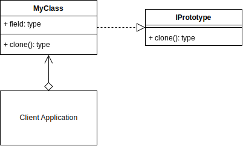
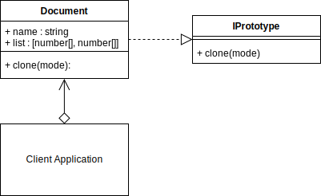

# Prototype Design Pattern

## Overview

The Prototype design pattern is good for when creating new objects requires more resources than you want to use or have available. You can save resources by just creating a copy of any existing object that is already in memory.

E.g., A file you've downloaded from a server may be large, but since it is already in memory, you could just clone it, and work on the new copy independently of the original.

In the Prototype patterns interface, you create a clone method that should be implemented by all classes that use the interface. How the clone method is implemented in the concrete class is up to you. You will need to decide whether a shallow or deep copy is required

- A shallow copy, copies and creates new references one level deep,
- A deep copy, copies and creates new references for all levels.

In JavaScript, you have mutable objects such as `Arrays`, `Dictionaries`, `Sets` and any custom Objects you may have created. A shallow copy, will create new copies of the objects with new references in memory, but the underlying data, e.g., the actual elements in an array, will point to the same memory location as the original array/object being copied. You will now have two arrays, but the elements within the arrays will point to the same memory location. So, changing any elements of a copied array will also affect the original array. Be sure to test your implementation that the copy method you use works as expected. Shallow copies are much faster to process than deep copies and deep copies are not always necessary if you are not going to benefit from using it.

## Terminology

- **Prototype Interface:** The interface that describes the clone() method.

- **Prototype:** The Object/Product that implements the Prototype interface.

- **Client:** The client application that uses and creates the ProtoType.

## Prototype UML Diagram

## Prototype Use Case

In this example, an object called document is cloned using shallow and deep methods.

I clone the documents instance properties and methods.

The object contains an array of two arrays. Three copies are created, and each time some part of the array is changed on the clone, and depending on the method used, it can affect the original object.

When cloning an object, it is good to understand the deep versus shallow concept of copying and whether you also want the clone to contain the classes methods.

### Prototype Example UML Diagram

## Summary

- Just like the other creational patterns, a Prototype is used to create an object at runtime.
- A Prototype is created from an object that is already instantiated. Imagine using the existing object as the class template to create a new object, rather than calling a specific class. Note that, the clone method used in the concept video demonstrated didn't copy the class methods to the new object. The clones only contained copies of the instance properties. If you want your new clone to have the same methods of the original class, then use the classes' constructor when returning the clone as I did in the `clone(mode)` method in `document.ts`.
- The ability to create a Prototype means that you don't need to create many classes for specific combinations of objects. You can create one object, that has a specific configuration, then clone it and alter some factor of it, then create another clone from this altered configuration, and keep continuing to create many objects which are all slightly different from each other.
- New Prototypes can be created at runtime, without knowing what kind of attributes the prototype may eventually have. E.g., You have a sophisticated object that was randomly created from many factors, and you want to clone it rather than adding all those same factors over and over again until the new object matches the one that could have just been cloned.
- A prototype is also useful for when you want to create a copy of an object, but creating that copy may be very resource intensive. E.g., you can either create a new houseboat from the builder example, or clone an existing houseboat from one already in memory.
- When designing your clone() method, you should consider which elements will be shallow copied or deep copied.
