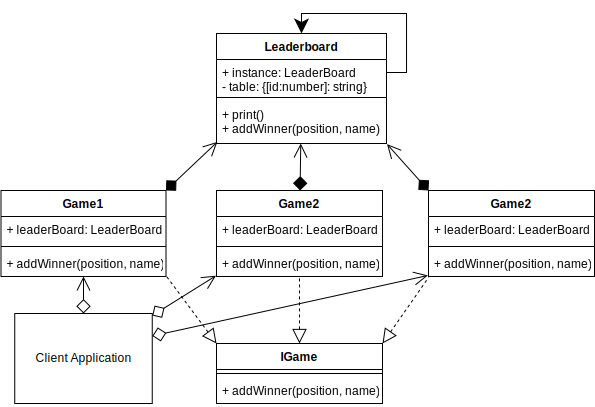

# Singleton Design Pattern

## Overview

Sometimes you need an object in an application where there is only one instance.

You don't want there to be many versions, for example, you have a game with a score, and you want to adjust it. You may have accidentally created several instances of the class holding the score object. Or, you may be opening a database connection, there is no need to create many, when you can use the existing one that is already in memory. You may want a logging component, and you want to ensure all classes use the same instance. So, every class could declare their own logger component, but behind the scenes, they all point to the same memory address.

By creating a class and following the Singleton pattern, you can enforce that even if any number of instances were created, they will still refer to the original class.

The Singleton can be accessible globally, but it is not a global variable. The Singleton class can be instanced at any time, but after it is first instanced, any new instances will point to the same instance as the first.

## Singleton UML Diagram

## Singleton Use Case

In the example, there are three games created. They are all independent instances created from their own class, but they all share the same leaderboard. The leaderboard is a Singleton.

It doesn't matter how the Games where created, or how they reference the leaderboard, it is always a Singleton.

Each game independently adds a winner, and all games can read the altered leaderboard regardless of which game updated it.

### Singleton Example UML Diagram

## Summary

- To be a Singleton, there must only be one copy of the Singleton, no matter how many times, or in which class it was instantiated.
- You want the attributes or methods to be globally accessible across your application, so that other classes may be able to use the Singleton.
- You can use Singletons in other classes, as I did with the leaderboard, and they will all use the same Singleton instance regardless.
- You want controlled access to a sole instance.
- A singleton differs from a class containing just static methods and properties in the way that you can make your Singleton implement an interface and/or extend a base class. You also create an instance of a Singleton at runtime using the new keyword.
