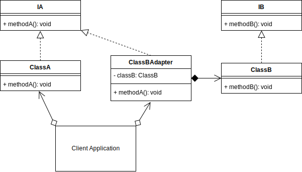
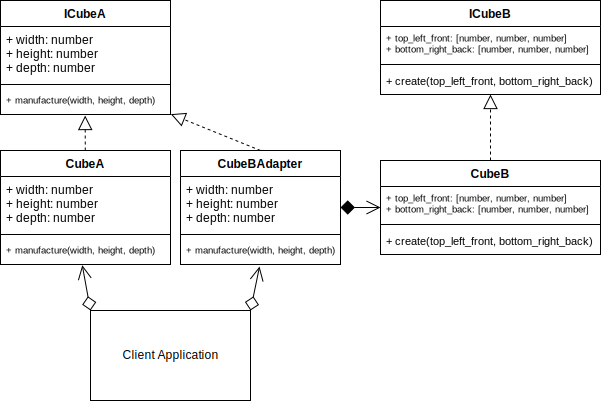

# Adapter Design Pattern

## Overview

Sometimes classes have been written, and you don't have the option of modifying their interface to suit your needs. This happens if the method you are calling is on a different system across a network, a library that you may import or generally something that is not viable to modify directly for your particular needs.

The Adapter design pattern solves these problems:

- How can a class be reused that does not have an interface that a client requires?
- How can classes that have incompatible interfaces work together?
- How can an alternative interface be provided for a class?

You may have two classes that are similar, but they have different method signatures, so you create an Adapter over top of one of the method signatures so that it is easier to implement and extend in the client.

An adapter is similar to the `Decorator` in the way that it also acts like a wrapper to an object. It is also used at runtime; however, it is not designed to be used recursively.

It is an alternative interface over an existing interface. Furthermore, it can also provide extra functionality that the interface being adapted may not already provide.

The adapter is similar to the `Facade`, but you are modifying the method signature, combining other methods and/or transforming data that is exchanged between the existing interface and the client.

The Adapter is used when you have an existing interface that doesn't directly map to an interface that the client requires. So, then you create the Adapter that has a similar functional role, but with a new compatible interface.

## Terminology

- **Target:** The domain specific interface or class that needs to be adapted.

- **Adapter:** The concrete adapter class containing the adaption process.

- **Adapter Interface:** The interface that the adapter will need to implement in order to make the target compatible with the client.

- **Client:** The client application that will use the Adapter.

## Adapter UML Diagram

## Adapter Use Case

In this concept source code, there are two classes, `ClassA` and `ClassB`, with different method signatures. Let's consider that `ClassA` provides the most compatible and preferred interface for the client.

I can create objects of both classes in the client, and it works. But before using each objects method, I need to do a conditional check to see which type of class it is that I am calling since the method signatures are different.

It means that the client is doing extra work. Instead, I can create an Adapter interface for the incompatible `ClassB`, that reduces the need for the extra conditional logic.

### Decorator Example UML Diagram

## Summary

- Use the Adapter when you want to use an existing class, but its interface does not match what you need.
- The adapter adapts to the interface of its parent class for those situations when it is not viable to modify the parent class to be domain-specific for your use case.
- Adapters will most likely provide an alternative interface over an existing object, class or interface, but it can also provide extra functionality that the object being adapted may not already provide.
- An adapter is similar to a `Decorator` except that it changes the interface to the object, whereas the decorator adds responsibility without changing the interface. This also allows the Decorator to be used recursively.
- An adapter is similar to the `Bridge` pattern and may look identical after the refactoring has been completed. However, the intent of creating the Adapter is different. The Bridge is a result of refactoring existing interfaces, whereas the Adapter is about adapting over existing interfaces that are not viable to modify due to many existing constraints. E.g., you don't have access to the original code, or it may have dependencies that already use it and modifying it would affect those dependencies negatively.
