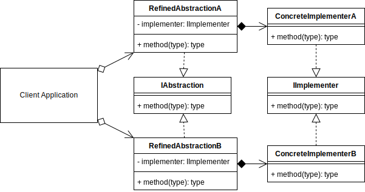

# Bridge Design Pattern

## Overview

The **Bridge pattern** is similar to the `Adapter` except in the intent that you developed it.

The Bridge is an approach to refactor already existing code, whereas the Adapter creates an interface on top of existing code through existing available means without refactoring any existing code or interfaces.

The motivation for converting your code to the Bridge pattern is that it may be tightly coupled. There is logic and abstraction close together that is limiting your choices in how you can extend your solution in the way that you need.

E.g., you may have one Car class, that produces a very nice car.

```typescript
const CAR = new Car();
//> Car has wheels and engine and windows and everything else.
```

But you would like to delegate the engine dynamically from a separate set of classes or solutions.

```typescript
const ENGINE = new EngineA();
const CAR = new Car(ENGINE);
```

The Bridge pattern is a process about separating abstraction and implementation, so this will allow you more ways of using your classes.

A Bridge didn't exist before, but since after the separation of interface and logic, each side can be extended independently of each other.

The Bridge pattern should use composition instead of inheritance. This means that you assign the relationship when the object is created at runtime rather than hard coded in the class definition.

I.e., `CAR = new Car(EngineA)` rather than `class Car extends EngineA`

A Bridge implementation will generally be cleaner than an Adapter solution that was bolted on. Since it involved refactoring existing code, rather than layering on top of legacy or third-party solutions that may not have been intended for your particular use case.

## Terminology

- **Abstraction Interface:** An interface implemented by the refined abstraction describing the common methods to implement.
- **Refined Abstraction:** A refinement of an idea into another class or two. The classes should implement the Abstraction Interface and assign which concrete implementer.
- **Implementer Interface:** The implementer interface that concrete implementers implement.
- **Concrete Implementer:** The implementation logic that the refined abstraction will use.

## Bridge UML Diagram



## Bridge Use Case

In this example, I draw a square and a circle. Both of these can be categorized as shapes.

The shape is set up as the abstraction interface. The refined abstractions, Square and Circle, implement the IShape interface.

When the Square and Circle objects are created, they are also assigned their appropriate implementers being SquareImplementer and CircleImplementer.

When each shape's draw method is called, the equivalent method within their implementer is called.

The Square and Circle are bridged and each implementer and abstraction can be worked on independently.

### Bridge Example UML Diagram


## Summary

- Use when you want to separate a solution where the abstraction and implementation may be tightly coupled, and you want to break it up into smaller conceptual parts.
- Once you have added the bridge abstraction, you should be able to extend each side of it separately without breaking the other.
- Also, once the bridge abstraction exists, you can more easily create extra concrete implementations for other similar products that may also happen to be split across similar conceptual lines.
- The Bridge pattern is similar to the adapter pattern except in the intent that you developed it. The bridge is an approach to refactor already existing code, whereas the adapter adapts to the existing code through its existing interfaces and methods without changing the internals.
