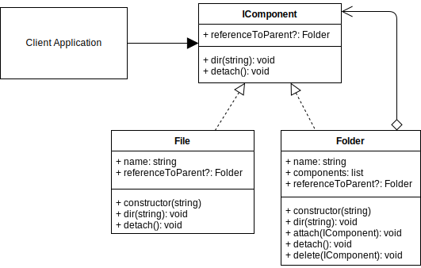

# Composite Design Pattern

## Overview

The **Composite** design pattern is a structural pattern useful for hierarchical management.

The Composite design pattern,

- Allows you to represent individual entities(leaves) and groups of leaves as the same.
- Is a structural design pattern that lets you compose objects into a changeable tree structure.
- Is great if you need the option of swapping hierarchical relationships around.
- Allows you to add/remove components to the hierarchy.
- Provides flexibility of structure

Examples of using the Composite Design Pattern can be seen in a file system directory structure where you can swap the hierarchy of files and folders, and also in a drawing program where you can group, ungroup, transform objects and change multiple objects at the same time.

## Terminology

- **Component Interface:** The interface that all leaves and composites should implement.
- **Leaf:** A single object that can exist inside or outside a composite.
- **Composite:** A collection of leaves and/or other composites.

## Composite UML Diagram

## Composite Use Case

Demonstration of a simple in memory hierarchical file system.

A root object is created that is a composite.

Several files (leaves) are created and added to the root folder.

More folders (composites) are created, and more files are added, and then the hierarchy is reordered.

### Composite Example UML Diagram

## Summary

- The Composite design pattern allows you to structure components in a manageable hierarchical order.
- It provides flexibility of structure since you can add/remove and reorder components.
- File explorer on Windows is a very good example of the composite design pattern in use.
- Any system where you need to offer at runtime the ability to group, ungroup, modify multiple objects at the same time, would benefit from the composite design pattern structure. Programs that allow you to draw shapes and graphics will often also use this structure as well.
