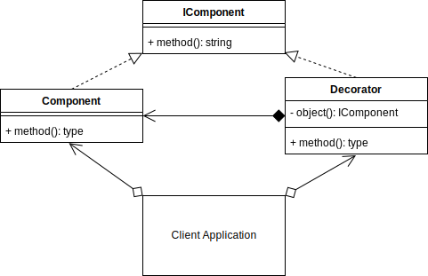
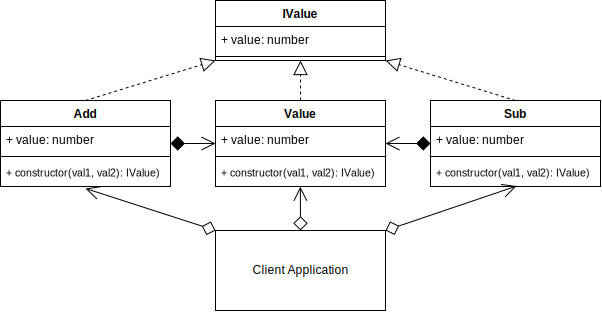

# Decorator Design Pattern

## Overview

The **decorator pattern** is a structural pattern, that allows you to attach additional responsibilities to an object at runtime.

The decorator pattern is used in both the Object-Oriented and Functional paradigms.

The decorator pattern adds extensibility without modifying the original object.

The decorator forwards requests to the enclosed object and can perform extra actions.

You can nest decorators recursively.

## Terminology

- **Component Interface:** An interface for objects.

- **Component:** The object that may be decorated.

- **Decorator:** The class that applies the extra responsibilities to the component being decorated. It also implements the same component interface.

## Decorator UML Diagram



## Decorator Use Case

Let's create a custom class called Value that will hold a number.

Then add decorators that allow addition (`Add`) and subtraction (`Sub`) to a number (`Value`).

The `Add` and `Sub` decorators can accept numbers directly, a custom `Value` object or other `Add` and `Sub` decorators.

`Add`, `Sub` and `Value` all implement the IValue interface and can be used recursively.

Note that in this example use case, I have created the `Add`, `Sub` and `Value` as functions that return new instances of classes `_Add`, `_Sub` and `_Value`. This was not necessary, but it means that I can use the `Add`, `Sub` and `Value` in a recursive manner without needing to prefix the new keyword in front of each usage all the time.

E.g,

```typescript
console.log(Add(Sub(Add(C, B), A), 100).value);
```

Alternatively, I could have named my classes as `Add`, `Sub` and `Value` and then used them recursively directly as

```typescript
console.log(new Add(new Sub(new Add(C, B), A), 100).value);
```

### Decorator Example UML Diagram



## Summary

- Use the decorator when you want to add responsibilities to objects dynamically without affecting the inner object.
- You want the option to later remove the decorator from an object in case you no longer need it.
- It is an alternative method to creating multiple combinations of subclasses. I.e., Instead of creating a subclass with all combinations of objects A, B, C in any order, and including/excluding objects, you could create 3 objects that can decorate each other in any order you want. E.g., (C(A(C))) or (B(C)) or (A(B(A(C))))
- The decorator, compared to extending, is more flexible since you can easily add/remove the decorators at runtime. E.g., use in a recursive function.
- A decorator supports recursive composition. E.g., halve(halve(number))
- A decorator shouldn't modify the internal objects data or references. This allows the original object to stay intact if the decorator is later removed.
