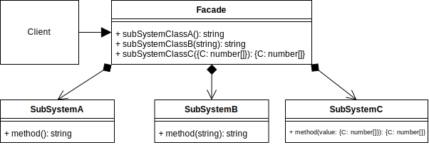
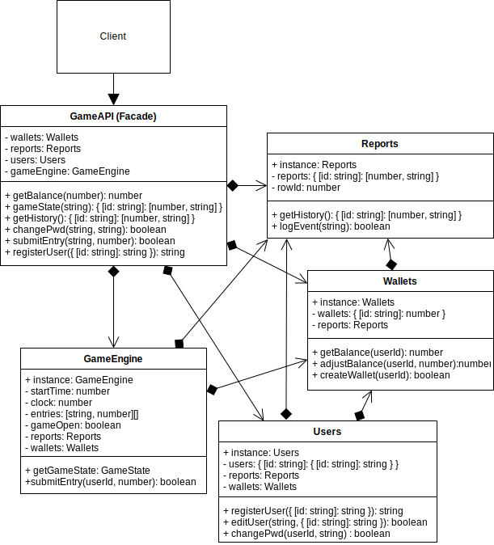

# Facade Design Pattern

## Overview

Sometimes you have a system that becomes quite complex over time as more features are added or modified. It may be useful to provide a simplified API over it. This is the Facade pattern.

The Facade pattern essentially is an alternative, reduced or simplified interface to a set of other interfaces, abstractions and implementations within a system that may be full of complexity and/or tightly coupled.

It can also be considered as a higher-level interface that shields the consumer from the unnecessary low-level complications of integrating into many subsystems.

## Facade UML Diagram

## Facade Use Case

This is an example of a game engine API. The facade layer is creating one streamlined interface consisting of several methods from several larger API backend systems.

The client could connect directly to each subsystem's API and implement its authentication protocols, specific methods, etc. While it is possible, it would be quite a lot of consideration for each of the development teams, so the facade API unifies the common methods that becomes much less overwhelming for each new client developer to integrate into.

### Facade Example UML Diagram

## Summary

- Use when you want to provide a simple interface to a complex subsystem.
- You want to layer your subsystems into an abstraction that is easier to understand.
- `Abstract Factory` and Facade can be considered very similar. An Abstract Factory is about creating in interface over several creational classes of similar objects, whereas the Facade is more like an API layer over many creational, structural and/or behavioral patterns.
- The `Mediator` is similar to the Facade in the way that it abstracts existing classes. The Facade is not intended to modify, load balance or apply any extra logic. A subsystem does not need to consider that existence of the facade, it would still work without it.
- A Facade is a minimal interface that could also be implemented as a `Singleton`.
- A Facade is an optional layer that does not alter the subsystem. The subsystem does not need to know about the Facade, and could even be used by many other facades created for different audiences.
