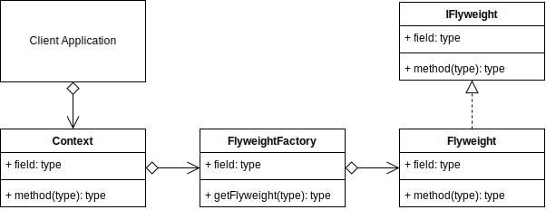

# Flyweight Design Pattern

## Overview

`Fly` in the term `Flyweight` means light/not heavy.

Instead of creating thousands of objects that share common attributes, and result in a situation where a large amount of memory or other resources are used, you can modify your classes to share multiple instances simultaneously by using some kind of reference to the shared object instead.

The best example to describe this is a document containing many words and sentences and made up of many letters. Rather than storing a new object for each individual letter describing its font, position, color, padding and many other potential things. You can store just a lookup ID of a character in a collection of some sort and then dynamically create the object with its proper formatting etc., only as you need to.

This approach saves a lot of memory at the expense of using some extra CPU instead to create the object at presentation time.

The Flyweight pattern, describes how you can share objects rather than creating thousands of almost repeated objects unnecessarily.

A Flyweight acts as an independent object in any number of contexts. A context can be a cell in a table, or a div on an HTML page. A context is using the Flyweight.

You can have many contexts, and when they ask for a Flyweight, they will get an object that may already be shared amongst other contexts, or already within itself somewhere else.

When describing flyweights, it is useful to describe it in terms of intrinsic and extrinsic attributes.

Intrinsic (in or including) are the attributes of a flyweight that are internal and unique from the other flyweights. E.g., a new flyweight for every letter of the alphabet. Each letter is intrinsic to the flyweight.

Extrinsic (outside or external) are the attributes that are used to present the flyweight in terms of the context where it will be used. E.g., many letters in a string can be right aligned with each other. The extrinsic property of each letter is the new positioning of its X and Y on a grid.

## Terminology

- **Flyweight Interface:** An interface that describes the intrinsic properties of the flyweight.
- **Concrete Flyweight:** The actual flyweight object that stores the intrinsic attributes and is instantiated when needed by the factory.
- **Flyweight Factory:** Creates and manages the flyweights at runtime. It reuses flyweights or creates a new one on demand.
- **Context:** Any object(s) within your application that will use the Flyweight Factory.
- **Client:** The client application that contains contexts.

## Flyweight UML Diagram

## Flyweight Use Case

In this example, I create a dynamic table with 3 rows and 3 columns each. The columns are then filled with some kind of text, and also chosen to be left, right or center aligned.

The letters are the flyweights and only a code indicating the letter is stored. The letters and numbers are shared many times.

The column cells are the contexts, and they pass the extrinsic vales describing the combination of letters, the justification left, right or center, and the width of the table column that is then used for the space padding.

### Flyweight Example UML Diagram

## Summary

- Clients should access Flyweight objects only the through a FlyweightFactory object to ensure that they are shared.
- Intrinsic values are stored internally in the Flyweight.
- Extrinsic values are passed to the Flyweight and customize it depending on the context.
- Implementing the flyweight is a balance between storing all objects in memory, versus storing small unique parts in memory, and potentially calculating extrinsic values in the context objects.
- Use the flyweight to save memory when it is beneficial. The offset is that extra CPU may be required during calculating and passing extrinsic values to the flyweights.
- The flyweight reduces memory footprint because it shares objects and allows the possibility of dynamically creating extrinsic attributes.
- The contexts will generally calculate the extrinsic values used by the flyweights, but it is not necessary. Values can be stored or referenced from other objects if necessary.
- When architecting the flyweight, start with considering which parts of a common object may be able to be split and applied using extrinsic attributes.
