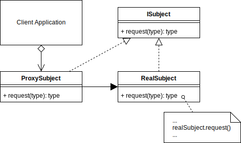

# Proxy Design Pattern

## Overview

The **Proxy** design pattern is a class functioning as an interface to another class or object.

A Proxy could be for anything, such as a network connection, an object in memory, a file, or anything else you need to provide an abstraction between.

Types of proxies,

- **Virtual Proxy:** An object that can cache parts of the real object, and then complete loading the full object when necessary.

- **Remote Proxy:** Can relay messages to a real object that exists in a different address space.

- **Protection Proxy:** Apply an authentication layer in front of the real object.

- **Smart Reference:** An object whose internal attributes can be overridden or replaced.

Additional functionality can be provided at the proxy abstraction if required. E.g., caching, authorization, validation, lazy initialization, logging.

The proxy should implement the subject interface as much as possible so that the proxy and subject appear identical to the client.

The Proxy Pattern can also be called **Monkey Patching** or **Object Augmentation**

## Terminology

- **Proxy:** An object with an interface identical to the real subject. Can act as a placeholder until the real subject is loaded or as gatekeeper applying extra functionality.
- **Subject Interface:** An interface implemented by both the Proxy and Real Subject.
- **Real Subject:** The actual real object that the proxy is representing.
- **Client:** The client application that uses and creates the Proxy.

## Proxy UML Diagram

## Proxy Use Case

In this example, I dynamically change the class of an object. So, I am essentially using an object as a proxy to other classes.

Every time the `tell_me_the_future()` method is called; it will randomly change the object to use a different class.

The object `PROTEUS` will then use the same static attributes and class methods of the new class instead.

### Proxy Example UML Diagram

## Summary

- Proxy forwards requests onto the Real Subject when applicable, depending on the kind of proxy.
  A virtual proxy can cache elements of a real subject before loading the full object into memory.
- A protection proxy can provide an authentication layer. For example, an NGINX proxy can add Basic Authentication restriction to an HTTP request.
- A proxy can perform multiple tasks if necessary.
- A proxy is different from an `Adapter`. The Adapter will try to adapt two existing interfaces together. The Proxy will use the same interface as the subject.
- It is also very similar to the `Facade`, except you can add extra responsibilities, just like the `Decorator`. The Decorator however can be used recursively.
- The intent of the Proxy is to provide a stand in for when it is inconvenient to access a real subject directly.
- The Proxy design pattern may also be called the Surrogate design pattern.
